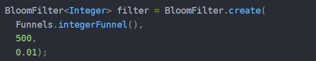
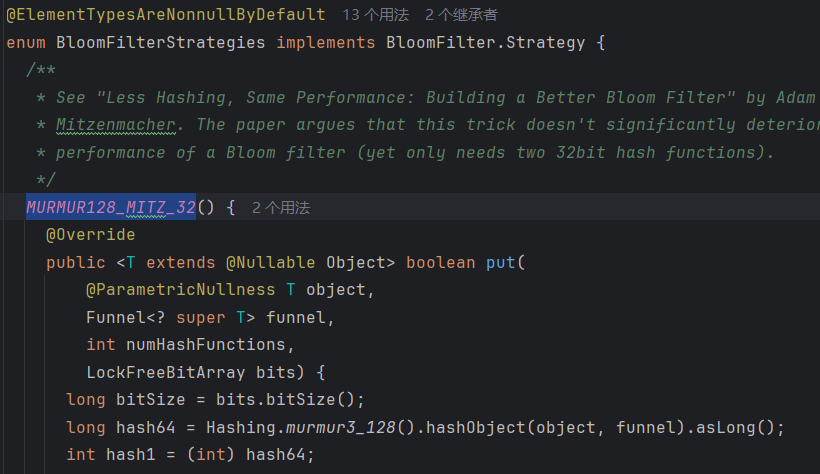
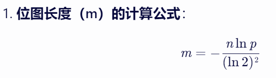
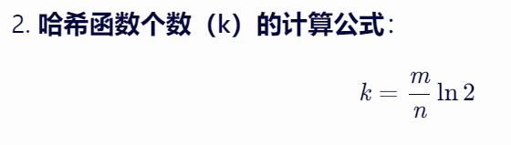
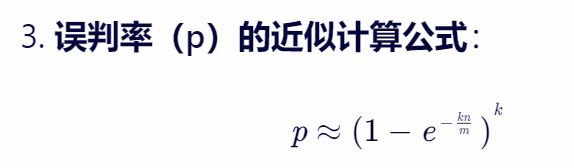
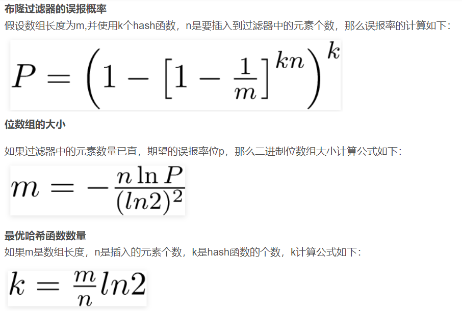
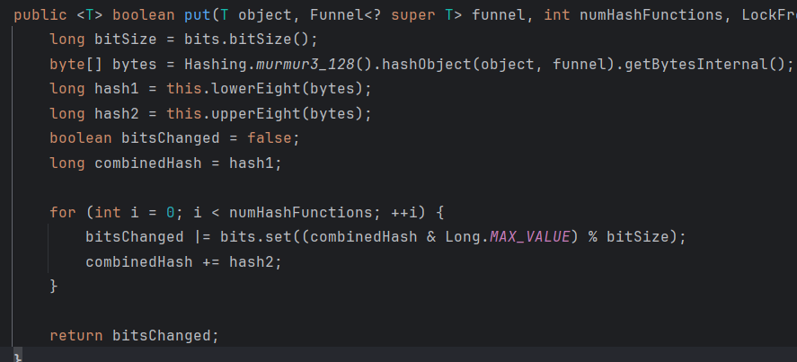

# min-bloom-filter
迷你布隆过滤器

# 布隆过滤器概述
1)布隆过滤器使用多个hash算法将输入数据转换为多个位图中的位.
这样注定会出现hash冲突,所以布隆过滤器无法保证100%准确.
并且由于无法确定有几个数据映射到了某个位,所以不支持删除数据, 只能重置位图.

2)哈希函数

布隆过滤器的性能受到哈希函数质量的影响，一个好的哈希函数能够更均匀地分布元素到位图上，从而降低误判率。

最后，布隆过滤器的优点在于空间效率高、查询速度快，但缺点在于存在误判率且不支持删除操作。因此，在选择是否使用布隆过滤器时，需要根据具体的应用场景和需求进行权衡。

# 编写逻辑

## 参考Guava布隆过滤器进行编写
可传递的参数, 数据类型/预估数据量/误差率/哈希算法

哈希函数的选择,使用策略模式

### 哈希策略枚举
mightContain和put方法
哈希函数的选择
哈希函数独立且生成的数值均匀分布，并且尽可能的快。比如MurmurHash、Jenkins_hash_function。

### 布隆过滤器相关公式
其中，m 是位图的长度（位数），n 是预估要插入的元素数量，p 是允许的误判率。

可以将ln2近似为0.7

### put方法实现
先使用murmur函数得到128位的哈希值(byte数组)
然后得到大小端后,使用大小端循环操作
